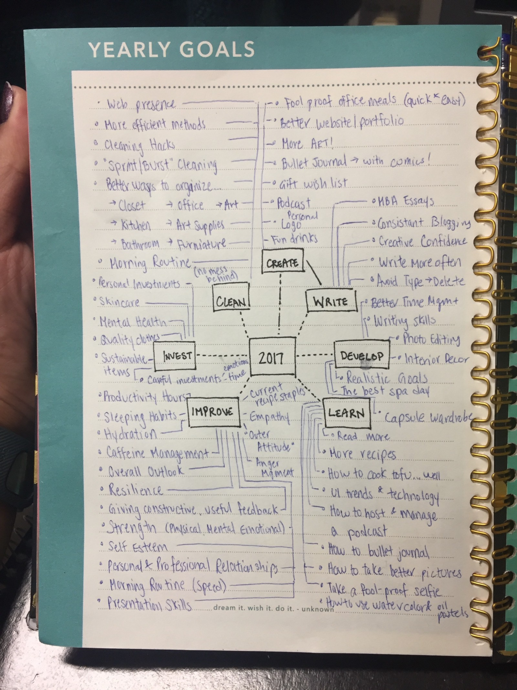
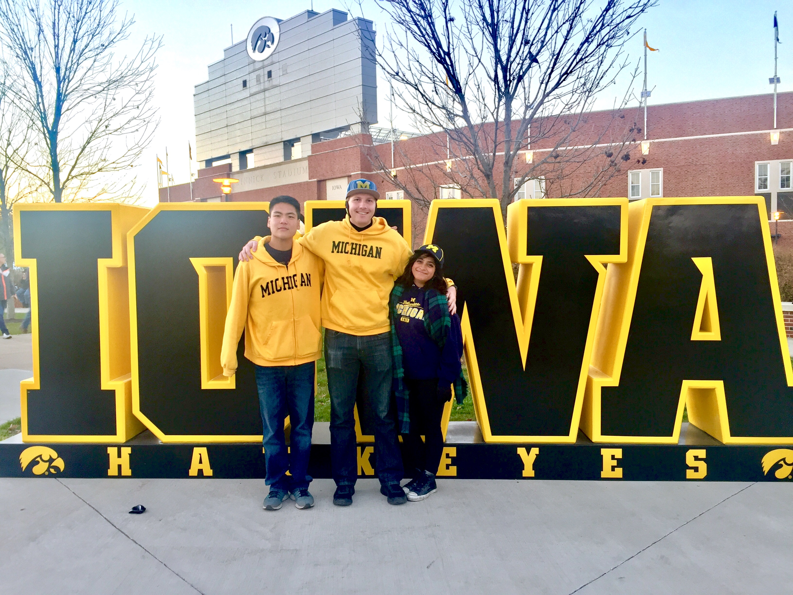

Well, we made it. 365 rotations and 1 revolution later, here we are. My twitter and medium feeds are full of ‘Year in Review’ and ‘2017 Resolutions’ posts, and also quite a few ‘Don’t do Resolutions! Do this’ type posts. Before sitting down to write this post, I decided to review my post from last year — “2015 in Review.” Reading through it again, it feels a bit forced and disjointed.

This post isn’t quite a ‘Year in Review,’ mainly because it doesn’t feel like a fresh start. Although it has been almost 2.5 years since I left school, my mental clock doesn’t reset on Jan 1st. Like a lot of students going back to school in the next couple of days, I feel like I’m continuing the school year, and just starting a new semester. This could also be because my planner is setup to run from July 2016-July 2017.

## Mind Map for 2016–2017

It took me a while to form and develop my goals for self betterment, but I didn’t fully execute and refine my “best practices” till September. In no particular order, here are some of the goals that I have been striving for:

<figure class="floatLeft">
	
	<figcaption>I really enjoyed the “Mind Map” exercise that CNBC shared on their website</figcaption>
</figure>

There are a lot of things here: Systems, Guiding Principles, Themes, Projects, Dreams, and more. The “2017” box in the middle is a bit misleading — all of these bullets have been attempted in one way or the other. Some of these have progressed at a more rapid pace than others, some of them have been mastered, others need to be taken back to the drawing board.

If I had written an update on each one of these bullets, this post would be ridiculously long…if not still in my head. So with my theme of “write,” and goal of developing “creative confidence,” I will be writing subsequent posts highlighting my progress. If there is really anyone out there, feel free to make a suggestion on what I should write about first.

## 2016 Highlights

I spent quite a lot of time with my family and college family during winter break, which was a wonderful time to reflect and scroll through my camera roll from the past year. Quite a few moments made me smile. I hope some of them make you smile too, and give you a bit of insight on what I have been up to this past year:

- Nate moved to Rochester
- Saw Pericles and Harvey at the Guthrie
- Built snowforts & snowmen outside IBM with Nate, Alex and Erica
- Perler Beads and Baking with Kendall
- Snowshoed, Cross Country Skied, Archery & Kickboxed with Susan
- Spoke at the SWE Region H Conference at UW Platteville, and at we16
- Ate at Outlaw Grill, and started the quest to create the perfect fish burrito
- Featured in an IBM Photo & Video shoot in New York City
- FINALLY saw STRFKR in concert in Des Moines (I tweeted them before the concert, and they opened with my favorite song)
- Radha visited the US
- Matt moved to Chicago
- “John Bieda Lady Pants”
- Went to Japan with the College Fam (subhighlights include my solo day in Asakusa, Going to an Onsen, and eating Melon Pan & Japanese Pancakes)
- Dyed my hair for the first time
- Saw Yanni in Concert (and basically re-lived my childhood)
- Finally went to the Minnesota State Fair
- Went to Kinnick stadium for the Michigan vs. Iowa Game
- Actually had the balls to shoot a gun (2 rifles, a handgun, and a revolver to be precise)

<figure class="floatLeft">
	
	
</figure>

Not pictured: several fits of rage, occasional crying, eye rolls, and the daily routine of a software engineer

Best Practices

I’ve been doing a lot of reading over the past few weeks on goal setting and annual reflections. I thought my notes from the “Best Practices” exercise would be useful to share. Note: this is nothing fancy, just a few things that have worked for me in 2016 (mainly this past semester)

- Semi-frequent at-home spa days are a glorious necessity
- Skincare is SUPER IMPORTANT — the first step to good skin is staying hydrated
- Drinking water from a glass water bottle is infinitely better
- Finding a decaf herbal tea that you like will kick your caffeine intake the the curb (I’m loving Trader Joe’s Ginger Turmeric Tea)
- Investing in a heated blanket will help you go to bed early (I turn it on when I’m sitting on the couch and get sleepy within the next hour)
- When they say “take it easy” after you donate blood…they mean it
- Echo chambers are dangerous, and often unproductive
- It’s all about the marketing and messaging — don’t alienate or forget your audience
- Writing often helps you figure out problems…do does therapy
- Overdrive is a super easy way (read: free) to get audio/ebooks (so make use of your local library!)
- Ellipticals are great for multitasking
- Exercise + Audiobooks/Podcasts = Happy Me
- It’s ok to be a “Bad Feminist” but it’s better to be an “Always Improving Feminist”
- Side projects are supposed to be fun, don’t let them turn into a chore
- Always keep in mind: What’s the Goal

So there it is. My first of many posts of 2017. If you made it this far, I hope you were able to find something useful. If not…¯\_(ツ)_/¯ better luck next time. As always, feedback is always appreciated. If there was something that resonated with you, feel free to comment on the post or tweet me. If you’d like to share some of your best practices, that would be fantastic — I’m always looking to compare notes, and do things better.
Sending good vibes and positive energy your way. Have a great semester!